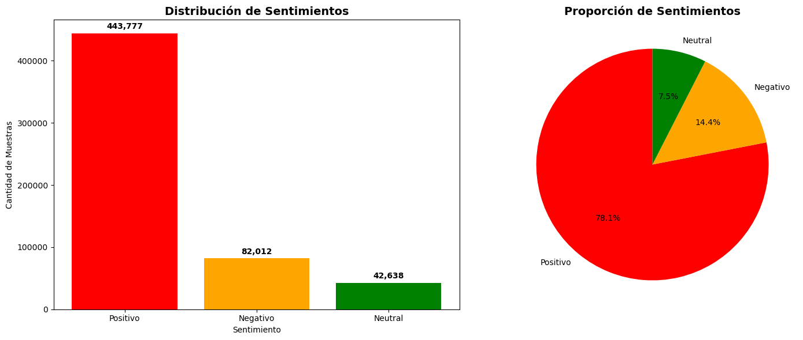

# Práctica 5: Análisis de Sentimientos - Amazon Fine Food Reviews

**Tecnologías de Lenguaje Natural**

Este proyecto implementa un sistema robusto de **Análisis de Sentimientos** aplicado al conjunto de datos *Amazon Fine Food Reviews*. El objetivo es procesar, limpiar y clasificar el lenguaje natural para determinar si la opinión de un consumidor es **Positiva, Neutral o Negativa**.

## 📋 Datos del Estudiante
* **Nombre:** Escamilla Lazcano Saúl
* **Grupo:** 5BV1
* **Carrera:** Ingeniería en Inteligencia Artificial
* **Profesor:** Ituriel Enrique Flores Estrada
* **Fecha de entrega:** 21 de diciembre de 2025

## 🚀 Metodología de Implementación

El análisis se aborda mediante tres enfoques distintos:

### A. Análisis basado en Diccionarios (Lexicons)
Uso de catálogos léxicos pre-etiquetados para calcular la carga afectiva del texto:
* **Opinion Lexicon:** Clasificación basada en conteo de términos positivos y negativos de NLTK.
* **SentiWordNet:** Uso de puntajes de sentimiento por significado de palabra (synsets).
* **Harvard IV-4:** Análisis psicosocial mediante la librería `pysentiment2`.

### B. Modelos de Aprendizaje de Máquina (Machine Learning)
Entrenamiento supervisado utilizando **TF-IDF** como técnica de extracción de características:
* **Modelos Base:** Regresión Logística, Árboles de Decisión y Máquinas de Soporte Vectorial (SVM).
* **Ensamble:** Implementación de **Stacking** para optimizar la predicción final.

### C. Redes Neuronales (Deep Learning)
Modelos basados en aprendizaje profundo:
* **Embedding Preconstruido:** Uso de vectores de palabras previamente entrenados.
* **Embedding Aprendido:** Capa de incrustación entrenada específicamente con el dataset.

## 🛠️ Tecnologías Utilizadas

* **Lenguaje:** Python
* **Librerías Principales:**
    * `pandas`, `numpy` (Procesamiento de datos)
    * `nltk`, `textblob`, `pysentiment2` (NLP y Lexicons)
    * `scikit-learn`, `imblearn` (Machine Learning)
    * `tensorflow`, `keras` (Deep Learning)
    * `matplotlib`, `seaborn` (Visualización)

## 📂 Estructura del Proyecto

El archivo principal es un Jupyter Notebook (`.ipynb`) que contiene todo el flujo de trabajo:
1. **Adquisición de Datos:** Carga del dataset `Reviews.csv`.
2. **Análisis Exploratorio de Datos (EDA):** Caracterización de las variables y limpieza.
3. **Implementación de Modelos:** Desarrollo de los tres enfoques de análisis.
4. **Evaluación:** Comparación de métricas y resultados.

## 📝 Dataset

Se utiliza el dataset [Amazon Fine Food Reviews](https://www.kaggle.com/datasets/snap/amazon-fine-food-reviews) disponible en Kaggle, que contiene reseñas de comida fina de Amazon.

## 📊 Resultados y Visualizaciones

### Distribución de Sentimientos
El dataset original presenta un desbalance significativo hacia comentarios positivos.

### Comparativa de Modelos
Se evaluaron distintos enfoques (Lexicons, Machine Learning y Deep Learning). Los modelos de **Deep Learning (Embeddings Entrenados)** y **Regresión Logística** obtuvieron los mejores resultados.

| Ranking | Método | Categoría | Accuracy |
|:---:|:---:|:---:|:---:|
| 1 | NN Embeddings Entrenados | Deep Learning | **0.7310** |
| 2 | Regresión Logística | Machine Learning | 0.7152 |
| 3 | Árboles de Decisión | Machine Learning | 0.4991 |

